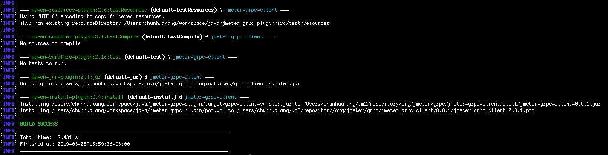
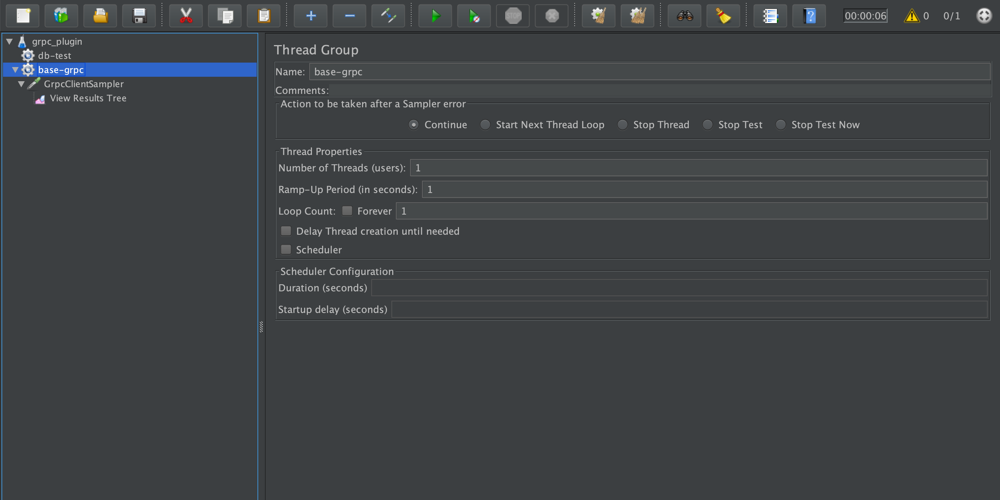
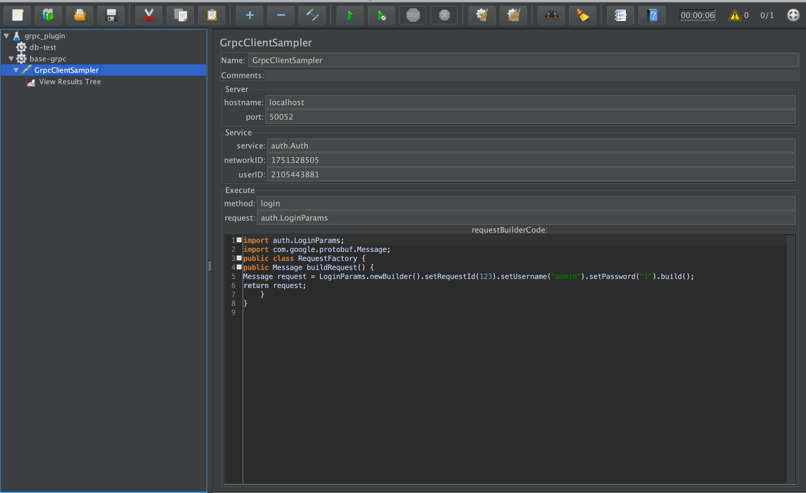
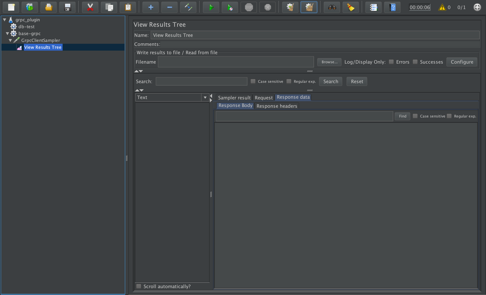
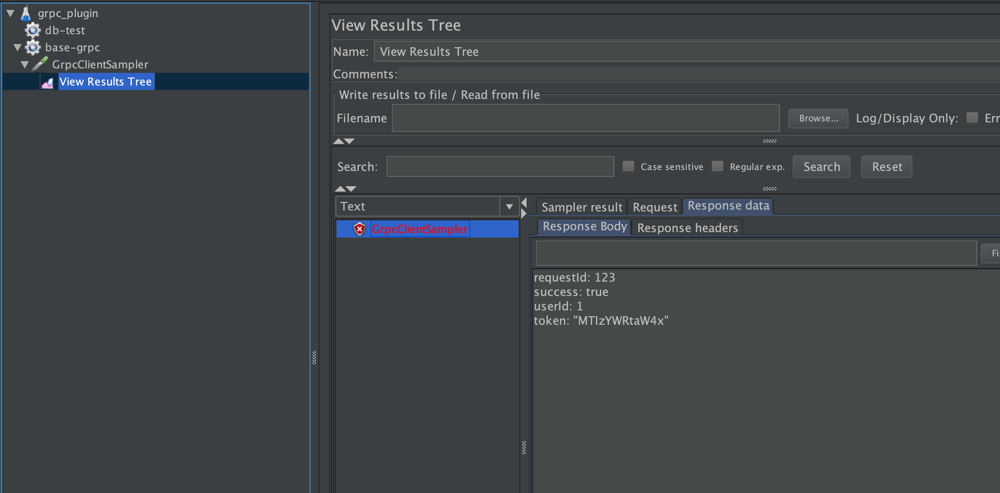

# jmeter-grpc-plugin

###背景与目标
通过该插件实现针对grpc接口的测试，并且可以利用jmeter的所有测试特性。
在 https://github.com/yangliCypressTest/jmeter-grpc-plugin的基础上做了一部分的修改。

###工程优势
* 无需编写独立的测试工程
* 有大量的报表支持实现多维度的指标监测
* 可以编写测试用例，测试用例便于传播
* 基本实现编码

###入门教程
####一 环境准备
* Jdk和maven环境（jdk8.0以上，maven 3.5以上）
* 下载源代码
ssh://gitlab@git.garena.com:2222/chunhua.kang/jmeter-grpc-plugin.git

####二 修改proto
在我们需要的测试的proto文件中加入一句话
> option java_multiple_files = true;

例如：
```
syntax="proto3";

package auth;

option java_multiple_files = true;

// The Customer service definition.
service Auth {
    rpc Login(LoginParams) returns (ResultResponse) {}
}

//空请求体
message LoginParams {
    int64 requestId =1;
    string username = 2;
    string password = 3;
}


//通用返回体定义
message ResultResponse {
  int64 requestId = 1;
  bool success = 2;
  string message = 3;
  int32 userId = 4;
  string token = 5;
}
```
####三 编译工程
> mvn clean install


> 得到jar: grpc-client-sampler.jar

####四 安装插件
把grpc-client-sampler.jar复制到jmeter/lib/ext

####五 编写测试用例
* 新建线程组


* 新建GrpcClientSampler


需要填写参数主要包括
hostname
port
service（对应proto的service）
method（对应proto的method）
request（对应proto的method的request）

```
import auth.LoginParams;
import com.google.protobuf.Message;
public class RequestFactory {
public Message buildRequest() {
Message request = LoginParams.newBuilder().setRequestId(123).setUsername("admin").setPassword("1").build();
return request;
    }
}

```

* 新建viewResultTree


####六 执行结果



####七 其他
> 附带例子jmx：jmx/GrpcGroup.jmx
> 因为jmeter没有完整的google和netty包，无法执行grpc，如果下载官方完整的jmeter要手动去公共仓库下载lib。我已经把所需要的lib下载好，打包好一个jmeter。启动方式和原版一样。
```
cd jmeter/bin   
./jmeter
```